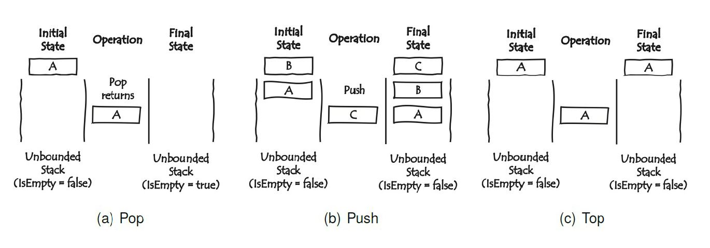

# CS-320-Fundamentals of Software Engineering
# Assignment 1: TDD-JUnit
# Description:
This assignment helps practice Test-Driven Development (TDD).

"3 laws of TDD are:
1. You may not write production code until you have written a failing unit test
2. You may not write more of a unit test than is sufficient to fail
3. You may not write more production code than is sufficient to pass the currently failing test
NOTE:: do not write the functional code in your head before you write the test."

In this assignment, use JUnit and Java to implement a bounded stack of size 5, namely MyStack, using an integer array. 
Recall the three basic operations of a traditional stack are push, pop, and top.

